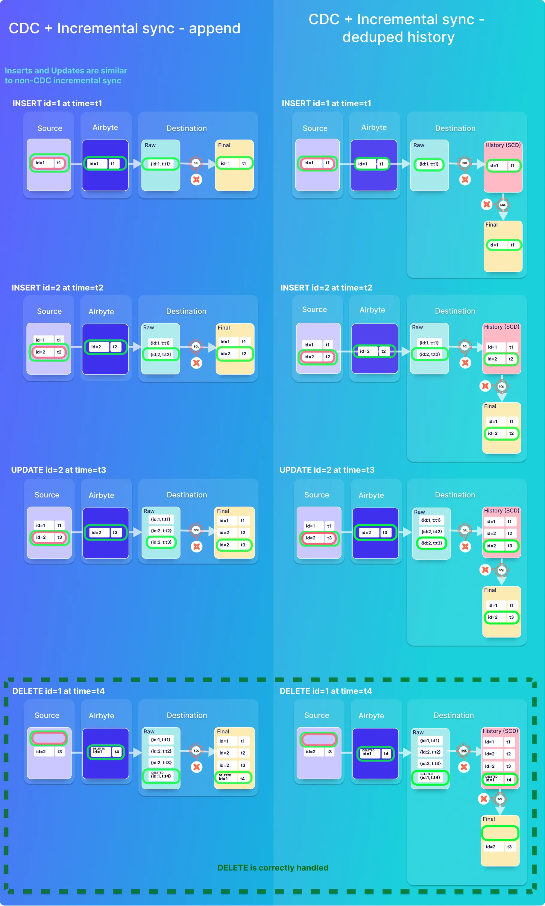

# Airbyte
> 一款数据同步工具

## Run
```shell
# clone Airbyte from GitHub
git clone --depth=1 https://github.com/airbytehq/airbyte.git

# switch into Airbyte directory
cd airbyte

# start Airbyte
./run-ab-platform.sh
./run-ab-platform.sh -b # -b --background  Run docker compose up in detached mode
```

## Flow


