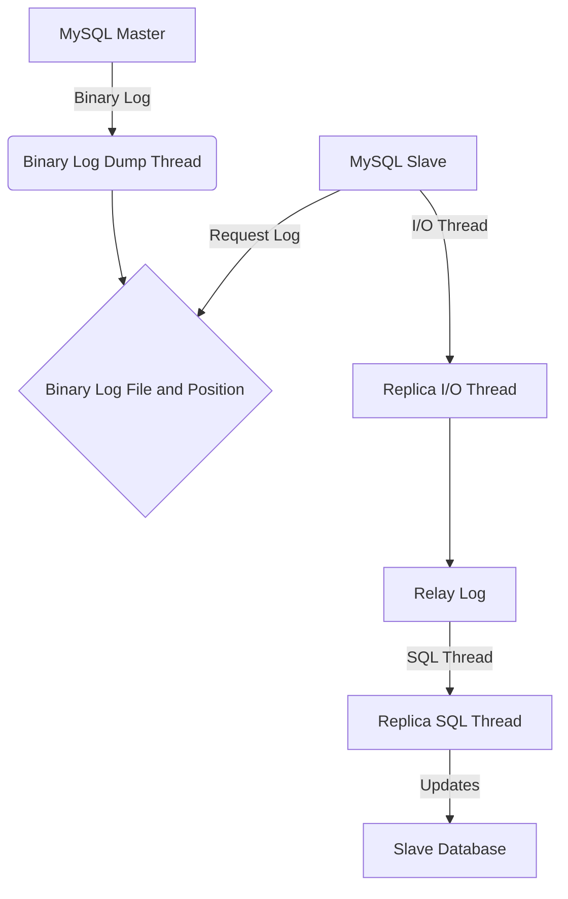

# MySQL主从同步

## Flow
> Create by https://excalidraw.com/

```mermaid
flowchart TD
    A[MySQL Master] -->|Binary Log| B(Binary Log Dump Thread)
    B --> C{Binary Log File and Position}
    D[MySQL Slave] -->|Request Log| C
    D -->|I/O Thread| E[Replica I/O Thread]
    E --> F[Relay Log]
    F -->|SQL Thread| G[Replica SQL Thread]
    G -->|Updates| H[Slave Database]
```
